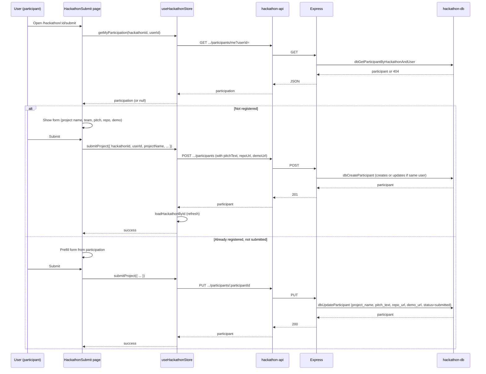
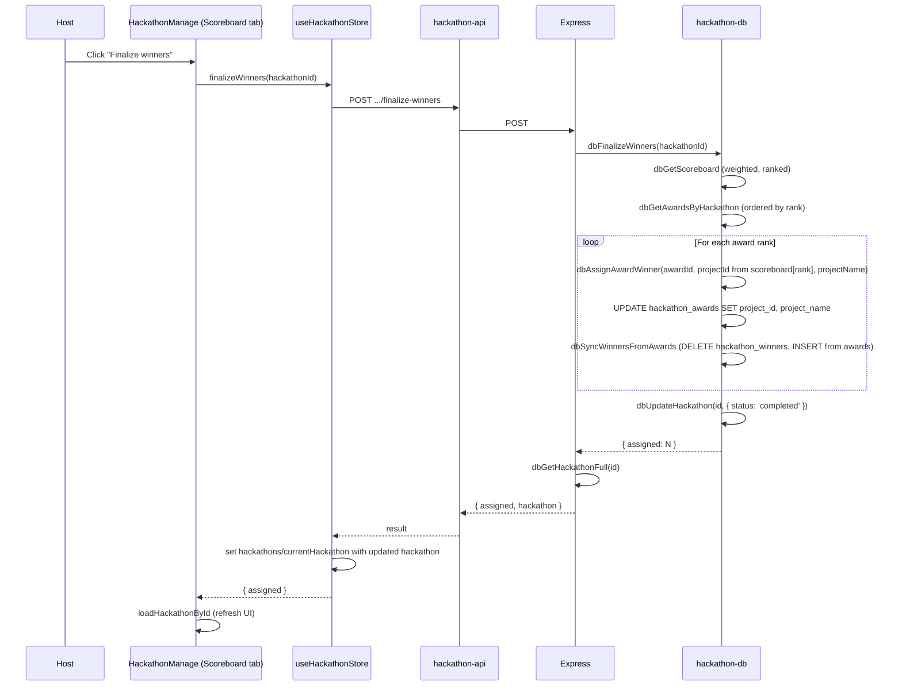
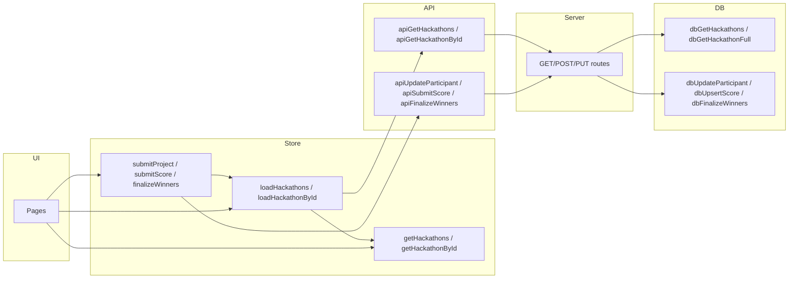

# Hackathon Module — Flows

End-to-end flows: submission, judging, and finalize.

## 1. Project submission flow



## 2. Judging flow (weighted scoreboard)

```mermaid
sequenceDiagram
    participant J as Judge
    participant M as HackathonManage (Judge tab)
    participant S as useHackathonStore
    participant API as hackathon-api
    participant Server as Express
    participant DB as hackathon-db

    J->>M: Submit score (project, criteria, score 0-100)
    M->>S: submitScore({ hackathonId, projectId, judgeId, criterionId, score, feedback })
    S->>API: POST .../scores
    API->>Server: POST
    Server->>DB: dbUpsertScore (insert or update per project+judge+criterion)
    DB-->>Server: score row
    Server-->>API: 201
    API-->>S: ok
    S->>S: loadHackathonById (refresh)

    Note over DB: Scoreboard = weighted average
    M->>S: getScoreboard(hackathonId)
    S->>S: from currentHackathon.scoreboard (from last load)
    alt Need fresh scoreboard
        S->>API: GET .../scoreboard
        API->>Server: GET
        Server->>DB: dbGetScoreboard(hackathonId)
        DB->>DB: Get criteria (weights), scores; per project: sum(avg(score)_c * weight_c/100)
        DB-->>Server: [{ projectId, projectName, totalScore, averageScore, scoreCount, rank }]
        Server-->>API: JSON
        API-->>S: scoreboard
    end
    S-->>M: scoreboard (ranked, weighted)
```

## 3. Finalize winners flow (automated)



## 4. State flow (store ↔ API ↔ DB)



- **Read**: UI calls `loadHackathons()` or `loadHackathonById()` → store calls API → server calls hackathon-db → store sets `hackathons` / `currentHackathon`; UI uses `getHackathons()` / `getHackathonById()`.
- **Write**: UI calls `submitProject()`, `submitScore()`, or `finalizeWinners()` → store calls API → server calls hackathon-db → store refreshes with `loadHackathonById()` so UI sees updated data.
