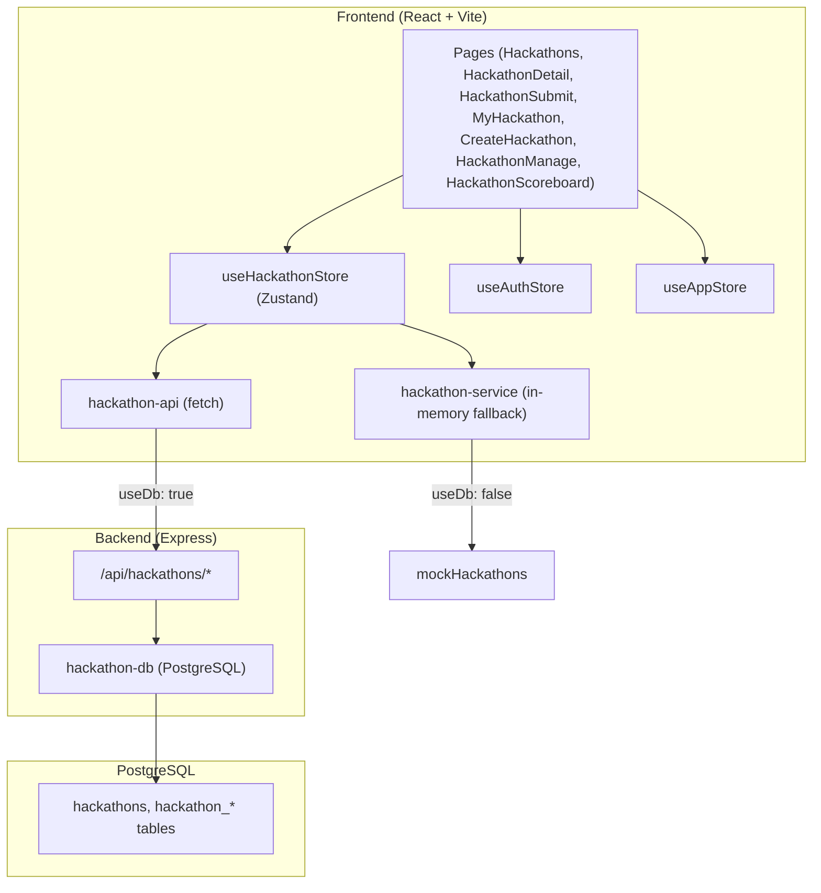
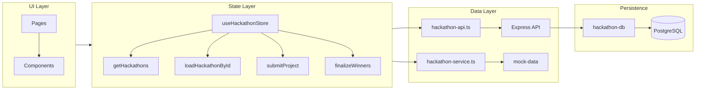
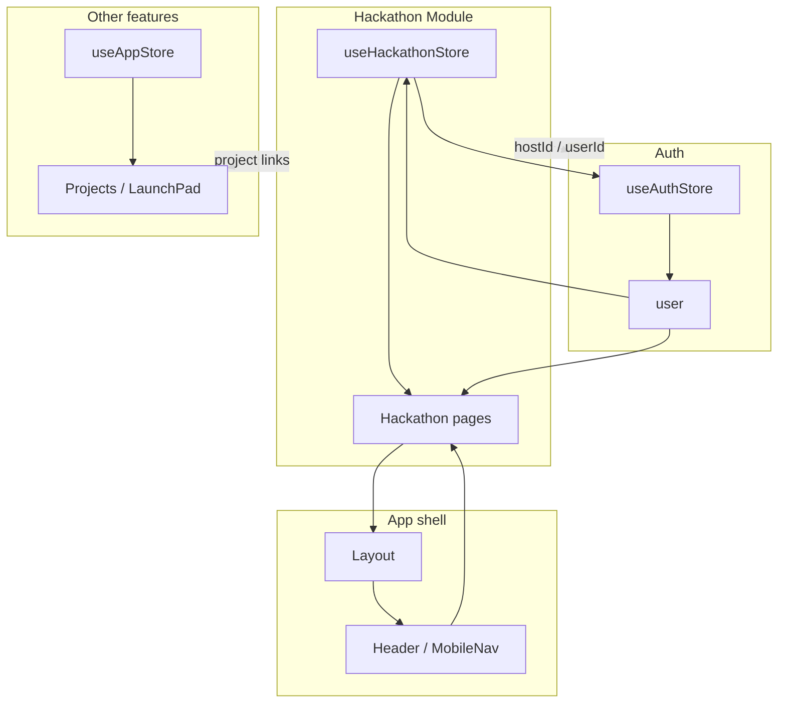

# Hackathon Module — System Overview

How the hackathon module fits into the app: layers, routes, and connections.

## High-level architecture

## Module layers

## File map

| Layer | Path | Role |
|-------|------|------|
| **Pages** | `src/pages/Hackathons.tsx`, `HackathonDetail.tsx`, `HackathonSubmit.tsx`, `MyHackathon.tsx` | List, detail, submit, “my hackathon” |
| **Module views** | `src/modules/hackathon/views/CreateHackathon.tsx`, `HackathonManage.tsx`, `HackathonScoreboard.tsx` | Create, manage, scoreboard |
| **Module components** | `src/modules/hackathon/components/*` | CreateHackathonForm, InviteParticipants, JudgeScoreForm, Scoreboard, AwardsPanel |
| **Store** | `src/modules/hackathon/services/hackathon-store.ts` | Single source of truth; calls API or in-memory service |
| **API client** | `src/modules/hackathon/services/hackathon-api.ts` | fetch to `/api/hackathons/*` |
| **In-memory** | `src/modules/hackathon/services/hackathon-service.ts` | Fallback when DB/API unavailable |
| **Types** | `src/modules/hackathon/types.ts`, `src/lib/types.ts` | Hackathon, awards, criteria, participants, etc. |
| **Server** | `src/server/api.ts` | Express routes for hackathons |
| **DB** | `src/lib/hackathon-db.ts` | All hackathon CRUD + scoreboard + finalize |
| **DB init** | `src/lib/database.ts` | Table creation + runHackathonMigrations() |

## Routes (React Router)

| Route | Component | Purpose |
|-------|-----------|--------|
| `/hackathons` | Hackathons | List hackathons (Explore) |
| `/my-hackathon` | MyHackathon | “Create project” / my hackathons |
| `/hackathon/create` | CreateHackathon | Host: create hackathon |
| `/hackathon/:id` | HackathonDetail | Public detail |
| `/hackathon/:id/submit` | HackathonSubmit | Participant: submit project |
| `/hackathon/:id/manage` | HackathonManage | Host: invite, judges, awards, scoreboard, finalize |
| `/hackathon/:id/scoreboard` | HackathonScoreboard | Public scoreboard |

## Connections to the rest of the system

- **Auth**: `useAuthStore` provides `user`; hackathon uses `user.id` for host, participant, and judge.
- **Layout/Nav**: Header and mobile nav link to Hackathons and “Create project” (My Hackathon).
- **App store**: Projects/LaunchPad can reference hackathon winners/projects; hackathon does not depend on app store for core flows.

## API endpoints (Express)

| Method | Path | Purpose |
|--------|------|--------|
| GET | `/api/hackathons` | List hackathons |
| GET | `/api/hackathons/:id` | Full hackathon (winners, participants, judges, awards, criteria, scoreboard) |
| POST | `/api/hackathons` | Create hackathon |
| PUT | `/api/hackathons/:id` | Update hackathon |
| GET | `/api/hackathons/:id/participants/me?userId=` | Current user’s participation |
| POST | `/api/hackathons/:id/participants` | Register (and optionally submit) |
| PUT | `/api/hackathons/:id/participants/:participantId` | Update submission |
| POST | `/api/hackathons/:id/invitations` | Invite by email (participant/judge) |
| POST | `/api/hackathons/:id/judges` | Add judge |
| PUT | `/api/hackathons/:id/awards/:awardId/winner` | Assign winner to award |
| POST | `/api/hackathons/:id/scores` | Submit judge score |
| GET | `/api/hackathons/:id/scoreboard` | Weighted scoreboard |
| POST | `/api/hackathons/:id/finalize-winners` | Auto-assign winners by rank, set status completed |
