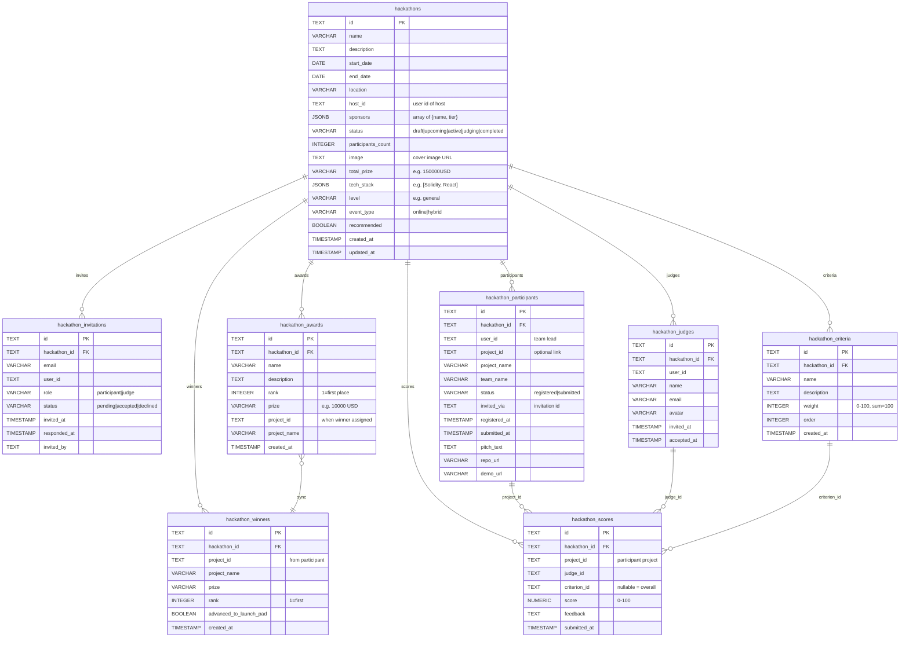

# Hackathon Module — Database Schema

Detailed schema for the hackathon feature: tables, columns, and relationships.

## Entity Relationship Diagram (hackathon only)

## Table summary

| Table | Purpose |
|-------|--------|
| **hackathons** | Event definition: name, dates, location, host, status, display fields (image, total_prize, tech_stack, level, event_type, recommended). |
| **hackathon_winners** | Display list of winners (synced from hackathon_awards when project_id is set). |
| **hackathon_invitations** | Invites by email/user to participate or judge. |
| **hackathon_participants** | Registration + submission: user_id, optional project_name/team_name, pitch_text, repo_url, demo_url, status, submitted_at. |
| **hackathon_judges** | Judges per hackathon (user_id, name, email). |
| **hackathon_awards** | Prize definitions (rank, prize); project_id/project_name set when winner is assigned. |
| **hackathon_criteria** | Judging criteria with weight (used for weighted scoreboard). |
| **hackathon_scores** | Judge scores per project, optionally per criterion. |

## Key flows in data

1. **Create hackathon** → insert `hackathons`; optionally insert `hackathon_awards` and `hackathon_criteria`.
2. **Register / submit** → insert or update `hackathon_participants` (project_name, pitch_text, repo_url, demo_url, status, submitted_at).
3. **Judging** → insert/update `hackathon_scores` (project_id, judge_id, criterion_id, score).
4. **Scoreboard** → computed from `hackathon_scores` + `hackathon_criteria` (weighted average).
5. **Finalize** → assign `hackathon_awards.project_id`/`project_name` by rank from scoreboard; sync into `hackathon_winners`; set `hackathons.status = 'completed'`.
