# Full Database Schema

PostgreSQL schema for the Launch Pad application: startups, users, and hackathon module.

## Entity Relationship Diagram (all tables)

```mermaid
erDiagram
    users ||--o{ user_activities : has
    users ||--o{ user_interactions : has
    startups ||--o{ team_members : has
    startups ||--o{ leaderboard : has
    startups ||--o{ user_activities : ref
    startups ||--o{ user_interactions : ref
    startups ||--o{ startup_support : has
    hackathons ||--o{ hackathon_winners : has
    hackathons ||--o{ hackathon_invitations : has
    hackathons ||--o{ hackathon_participants : has
    hackathons ||--o{ hackathon_judges : has
    hackathons ||--o{ hackathon_awards : has
    hackathons ||--o{ hackathon_criteria : has
    hackathons ||--o{ hackathon_scores : has

    users {
        SERIAL id PK
        VARCHAR name
        VARCHAR email UK
        VARCHAR avatar_url
        TEXT bio
        VARCHAR role
        JSONB preferences
        TIMESTAMP created_at
        TIMESTAMP updated_at
    }

    startups {
        SERIAL id PK
        VARCHAR name
        VARCHAR tagline
        TEXT description
        VARCHAR category
        VARCHAR stage
        DATE founded_date
        VARCHAR users
        VARCHAR growth
        INTEGER status
        VARCHAR founder_name
        VARCHAR founder_email
        TEXT founder_bio
        VARCHAR team_size
        TEXT problem
        TEXT solution
        TEXT target_market
        TEXT business_model
        VARCHAR revenue
        VARCHAR funding
        VARCHAR website
        VARCHAR email
        VARCHAR twitter
        VARCHAR linkedin
        VARCHAR github
        TEXT milestones
        TEXT challenges
        TEXT vision
        TEXT admin_feedback
        TIMESTAMP reviewed_at
        VARCHAR reviewed_by
        TIMESTAMP created_at
        TIMESTAMP updated_at
    }

    team_members {
        SERIAL id PK
        INTEGER startup_id FK
        VARCHAR name
        VARCHAR role
        TEXT bio
        TIMESTAMP created_at
    }

    leaderboard {
        SERIAL id PK
        INTEGER startup_id FK
        INTEGER rank
        VARCHAR growth_rate
        TIMESTAMP created_at
        TIMESTAMP updated_at
    }

    user_activities {
        SERIAL id PK
        INTEGER user_id FK
        INTEGER startup_id FK
        VARCHAR activity_type
        JSONB activity_data
        TIMESTAMP created_at
    }

    user_interactions {
        SERIAL id PK
        INTEGER user_id FK
        INTEGER startup_id FK
        VARCHAR interaction_type
        JSONB interaction_data
        VARCHAR status
        TIMESTAMP created_at
        TIMESTAMP updated_at
    }

    startup_support {
        SERIAL id PK
        INTEGER startup_id FK
        VARCHAR support_type
        VARCHAR title
        TEXT description
        TEXT requirements
        JSONB contact_info
        BOOLEAN is_active
        TIMESTAMP created_at
        TIMESTAMP updated_at
    }

    hackathons {
        TEXT id PK
        VARCHAR name
        TEXT description
        DATE start_date
        DATE end_date
        VARCHAR location
        TEXT host_id
        JSONB sponsors
        VARCHAR status
        INTEGER participants_count
        TEXT image
        VARCHAR total_prize
        JSONB tech_stack
        VARCHAR level
        VARCHAR event_type
        BOOLEAN recommended
        TIMESTAMP created_at
        TIMESTAMP updated_at
    }

    hackathon_winners {
        TEXT id PK
        TEXT hackathon_id FK
        TEXT project_id
        VARCHAR project_name
        VARCHAR prize
        INTEGER rank
        BOOLEAN advanced_to_launch_pad
        TIMESTAMP created_at
    }

    hackathon_invitations {
        TEXT id PK
        TEXT hackathon_id FK
        VARCHAR email
        TEXT user_id
        VARCHAR role
        VARCHAR status
        TIMESTAMP invited_at
        TIMESTAMP responded_at
        TEXT invited_by
    }

    hackathon_participants {
        TEXT id PK
        TEXT hackathon_id FK
        TEXT user_id
        TEXT project_id
        VARCHAR project_name
        VARCHAR team_name
        VARCHAR status
        TEXT invited_via
        TIMESTAMP registered_at
        TIMESTAMP submitted_at
        TEXT pitch_text
        VARCHAR repo_url
        VARCHAR demo_url
    }

    hackathon_judges {
        TEXT id PK
        TEXT hackathon_id FK
        TEXT user_id
        VARCHAR name
        VARCHAR email
        VARCHAR avatar
        TIMESTAMP invited_at
        TIMESTAMP accepted_at
    }

    hackathon_awards {
        TEXT id PK
        TEXT hackathon_id FK
        VARCHAR name
        TEXT description
        INTEGER rank
        VARCHAR prize
        TEXT project_id
        VARCHAR project_name
        TIMESTAMP created_at
    }

    hackathon_criteria {
        TEXT id PK
        TEXT hackathon_id FK
        VARCHAR name
        TEXT description
        INTEGER weight
        INTEGER order
        TIMESTAMP created_at
    }

    hackathon_scores {
        TEXT id PK
        TEXT hackathon_id FK
        TEXT project_id
        TEXT judge_id
        TEXT criterion_id
        NUMERIC score
        TEXT feedback
        TIMESTAMP submitted_at
    }
```

## Table groups

| Group | Tables | Purpose |
|-------|--------|--------|
| **Startups** | startups, team_members, leaderboard, startup_support | Startup submissions and leaderboard |
| **Users** | users, user_activities, user_interactions | User accounts and activity (integer IDs) |
| **Hackathon** | hackathons + 7 hackathon_* tables | Hackathon lifecycle (text IDs) |

## Notes

- **User IDs**: Startups/legacy use integer users.id; hackathon uses string host_id / user_id.
- **Cascade**: Hackathon tables use ON DELETE CASCADE from hackathons(id).
- **Initialization**: Run POST /init-db; runHackathonMigrations() adds optional columns to existing tables.
