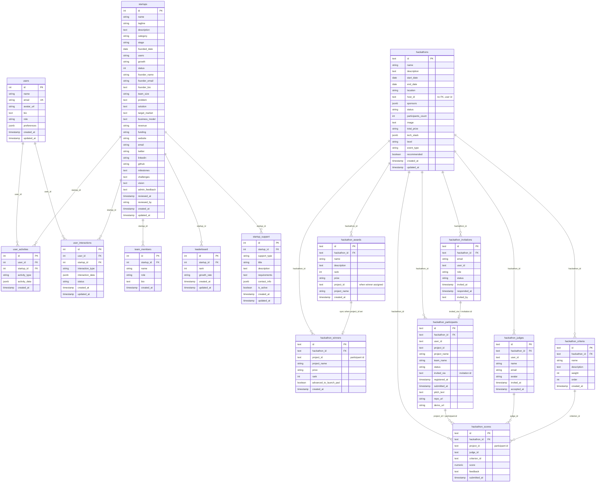

# Table interconnections

This document shows how every database table connects to others: foreign keys, logical references, and data flow.

---

## 1. Full system diagram (all tables)

---

## 2. Core domain: users and startups

Only tables that have **integer IDs** and explicit **foreign keys** in the schema.

| From table           | To table           | Column       | References        | Constraint   |
|----------------------|--------------------|-------------|-------------------|--------------|
| team_members          | startups           | startup_id  | startups.id       | ON DELETE CASCADE |
| leaderboard           | startups           | startup_id  | startups.id       | —            |
| user_activities       | users              | user_id     | users.id          | ON DELETE CASCADE |
| user_activities       | startups           | startup_id  | startups.id       | ON DELETE CASCADE |
| user_interactions     | users              | user_id     | users.id          | ON DELETE CASCADE |
| user_interactions     | startups           | startup_id  | startups.id       | ON DELETE CASCADE |
| startup_support       | startups           | startup_id  | startups.id       | ON DELETE CASCADE |

---

## 3. Hackathon domain: how tables interconnect

All hackathon tables use **text IDs** and reference **hackathons(id)** with `ON DELETE CASCADE`.

### 3.1 Direct foreign keys (in schema)

| From table              | To table    | Column       | References     |
|-------------------------|------------|--------------|----------------|
| hackathon_winners       | hackathons | hackathon_id | hackathons.id  |
| hackathon_invitations   | hackathons | hackathon_id | hackathons.id  |
| hackathon_participants | hackathons | hackathon_id | hackathons.id  |
| hackathon_judges       | hackathons | hackathon_id | hackathons.id  |
| hackathon_awards      | hackathons | hackathon_id | hackathons.id  |
| hackathon_criteria     | hackathons | hackathon_id | hackathons.id  |
| hackathon_scores       | hackathons | hackathon_id | hackathons.id  |

### 3.2 Logical / application-level links (no FK in DB)

| From table / column     | Points to                    | Meaning |
|-------------------------|-----------------------------|--------|
| hackathons.host_id      | users (by app logic)        | User who created the hackathon (string id) |
| hackathon_participants.invited_via | hackathon_invitations.id | Invitation that led to this registration |
| hackathon_scores.project_id | hackathon_participants.id | The submission being scored |
| hackathon_scores.judge_id   | hackathon_judges.id         | Judge who gave the score |
| hackathon_scores.criterion_id | hackathon_criteria.id    | Criterion (or null = overall) |
| hackathon_awards.project_id | hackathon_participants.id | Winner assigned to this award |
| hackathon_winners.project_id | hackathon_participants.id | Synced from hackathon_awards when winner set |

### 3.3 Hackathon interconnection diagram

---

## 4. Relationship summary

| Relationship type | Example |
|--------------------|--------|
| **One-to-many (FK)** | One `startups` row → many `team_members`, `leaderboard`, `startup_support`. One `hackathons` row → many `hackathon_participants`, `hackathon_scores`, etc. |
| **Many-to-one (FK)** | Many `user_activities` → one `users`; many `hackathon_scores` → one `hackathons`. |
| **Logical (no FK)** | `hackathon_scores.project_id` = `hackathon_participants.id`; `hackathon_scores.judge_id` = `hackathon_judges.id`; `hackathon_awards.project_id` → participant, then synced to `hackathon_winners`. |
| **Sync** | When an award winner is set (`hackathon_awards.project_id`), rows are synced into `hackathon_winners`. |

---

## 5. ID spaces

- **Integer IDs (SERIAL):** `users`, `startups`, `team_members`, `leaderboard`, `user_activities`, `user_interactions`, `startup_support`.
- **Text IDs (TEXT PK):** All hackathon tables. Hackathon domain does not use integer FKs to `users`; it uses string `user_id` / `host_id` for application-level linking.

For a visual ER view of columns only, see [SCHEMA_DATABASE.md](SCHEMA_DATABASE.md) and [HACKATHON_MODULE_SCHEMA.md](HACKATHON_MODULE_SCHEMA.md).
